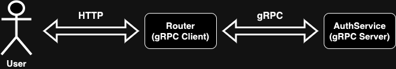

# Nillion-Assignment

This repository contains implementation of new authentication protocol based on Chaum Pedersen Protocol.

[](https://github.com/bidzyyys/nillion-assignment/actions/workflows/ci.yml)

-   [Nillion-Assignment](#nillion-assignment)

    -   [Overview](#overview)
        -   [Components](#components)
        -   [Limitations](#limitations)
        -   [Future improvements](#future-improvements)
    -   [Local development setup](#local-development-setup)
        -   [Rust and Cargo](#rust-and-cargo)
            -   [Cargo clippy linter](#cargo-clippy-linter)
        -   [pre-commit](#pre-commit)
            -   [Install the git hook script](#install-the-git-hook-script)
        -   [yarn](#yarn)
        -   [Docker](#docker)
    -   [Development](#development)
        -   [Format code](#format-code)
        -   [Run clippy linter](#run-clippy-linter)
        -   [Check that project builds](#check-that-project-builds)
        -   [Testing](#testing)
        -   [Build the project](#build-the-project)
        -   [Run pre-commit](#run-pre-commit)
    -   [CI Jobs](#ci-jobs)
    -   [Integration Tests](#integration-tests)
        -   [Running Integration Tests](#running-integration-tests)
    -   [Interacting with the system](#interacting-with-the-system)

## Overview

This diagram can help understand the overall solution architecture.


### Components

-   [AuthService](./auth_service) is the gRPC server providing functionalities for user registration and authentication.
-   [Router](./router) is the gRPC client providing mechanism for communication with `AuthService`.
-   [ZKP](./zkp) is the library providing implementation of ZKP (Chaum Pedersen Protocol).
-   [Integration Tests](./test) integration tests for the solution.

### Limitations

-   [ ] Solution uses `int64` - cause math overflow in most cases.
-   [ ] Some ZKP attributes like `g`, `h`, `q` are read from env variables and are constant for all users.
-   [ ] No data persistence - users are saved into InMemoryDatabase.

### Future improvements

-   [ ] Use BigInts.
-   [ ] Add persistent Key-Value Database.
-   [ ] Better handling for shared state in `Router` (gRPC Connection) and `AuthService` (`InMemoryRepository`, ZKP context).
-   [ ] `SessionId` should be generated in a proper way with time limitations and verification mechanisms on server side.
-   [ ] Adding additional functionalities that requires users to be logged in.

## Local development setup

### Rust and Cargo

Follow the [instruction](https://doc.rust-lang.org/cargo/getting-started/installation.html) to install Rust and Cargo.

#### Cargo clippy linter

Follow the [instruction](https://github.com/rust-lang/rust-clippy#usage) to install `clippy`.

### pre-commit

Follow the [instruction](https://pre-commit.com/#installation) to install `pre-commit` tool.

#### Install the git hook script

```sh
pre-commit install
```

#### Install yarn

Follow the [instruction](https://classic.yarnpkg.com/lang/en/docs/install/#mac-stable) to install `yarn`.

#### Install Docker

Follow the [instruction](https://docs.docker.com/engine/install/) to install Docker.

## Development

### Format code

```sh
cargo fmt
```

### Run clippy linter

```sh
cargo clippy --all-features
```

### Check that project builds

```sh
cargo check
```

### Testing

```sh
cargo test
```

### Build the project

```sh
cargo build --release
```

### Run pre-commit

```sh
pre-commit run --all-files
```

## CI Jobs

This repository contains predefined GitHub actions for quality assurance that can be found [here](./.github/workflows/ci.yml).

## Integration Tests

The integration tests for this project are written in JavaScript.

The tests are defined in [test/](./test/).

The test implementations are found in:

-   [test/e2e.js](./test/e2e.js): the test definitions for authentication "happy path".

### Running Integration Tests

From the project root

1. Install dependencies:

```sh
yarn install
```

2. Build Docker images:

```sh
docker compose --build
```

3. Start `docker compose`:

```sh
docker compose up
```

4. Run the tests:

```sh
yarn test
```

5. Stop `docker compose`

```sh
docker compose down
```

### Interacting with the system

1. Build Docker images:

```sh
docker compose --build
```

2. Start `docker compose`:

```sh
docker compose up
```

3. Play with the solution using HTTP Protocol:

-   Calculate registration data:

```sh
http POST localhost:8080/register/calculate user="bidzyyys" x:=9
```

-   Register user:

```sh
http POST localhost:8080/register username="bidzyyys" y1:=19683 y2:=1953125
```

-   Login user:

```sh
http POST localhost:8080/login user="bidzyyys" x:=9 k:=27
```

4. Stop `docker compose`

```sh
docker compose down
```
